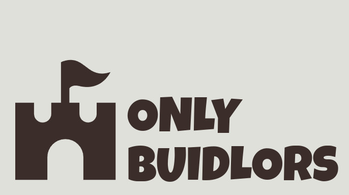

A dynamic SVG NFT project that uses chainlink functions to fetch off chain data from the BuidlGuidl API. All BuidlGuidl members with at least 1 published build are welcome to mint an NFT with a dynamic background color that changes based on the number of builds submitted!

### Getting Started

- TODO

### Technology Stack

- Scaffold ETH 2
- Chainlink Functions
- Alchemy NFT API
